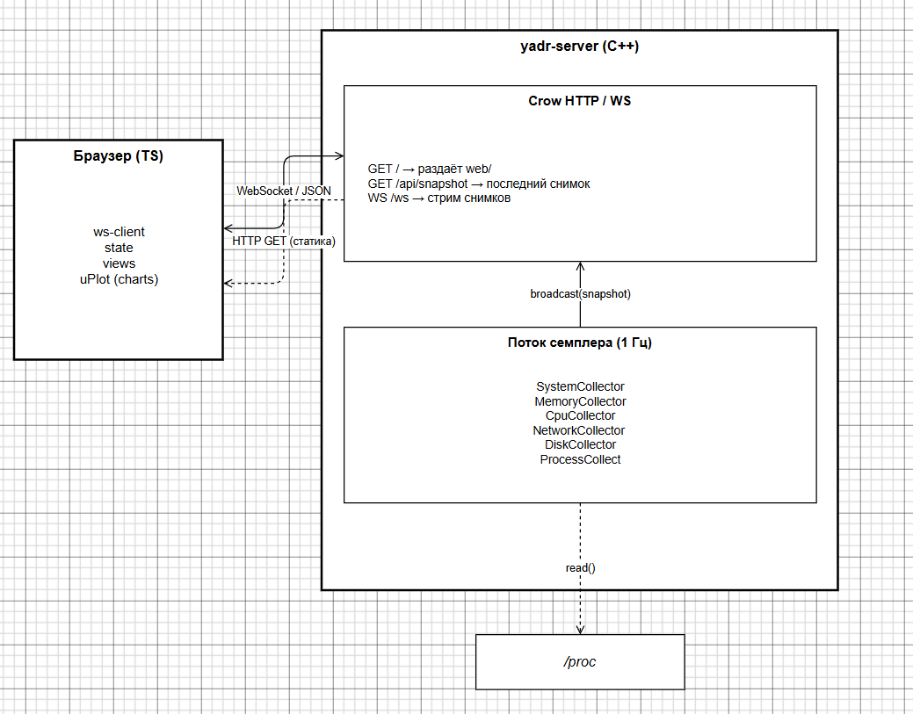

# YADR — Yet Another Desktop Resource monitor

Системный монитор с бэкендом на C++ и веб-интерфейсом на TypeScript. Данные передаются через WebSocket в реальном времени.

---

## Что показывает

- **Хост** -- имя машины, ядро, модель CPU, количество ядер, uptime, средняя нагрузка.
- **CPU** -- суммарная загрузка, полосы по ядрам, график за 2 минуты.
- **Память и своп** -- итого / занято / буферы / кэш, полосы + график.
- **Сеть** -- скорость rx/tx по интерфейсам и суммарный график.
- **Диски** -- скорость чтения/записи по устройствам и суммарный график.
- **Процессы** -- таблица с сортировкой и фильтрацией (PID, USER, CPU%, MEM%, RES, VIRT, TIME, COMMAND).

---

## Быстрый старт (Ubuntu 22.04)

```bash
# системные зависимости (один раз)
sudo apt update
sudo apt install -y build-essential cmake libasio-dev curl git

# Node.js 20.x 
curl -fsSL https://deb.nodesource.com/setup_20.x | sudo -E bash -
sudo apt install -y nodejs

# сборка (бэкенд через CMake/FetchContent, фронтенд через Vite)
./scripts/build.sh

# запуск
./scripts/run.sh
# открыть http://127.0.0.1:8080 в браузере
```

Скрипт запуска принимает любые флаги бинарника:

```bash
./scripts/run.sh --port 9000 --bind 0.0.0.0 --interval 500
```

| Флаг | По умолчанию | Описание |
|---|---|---|
| `--bind <addr>`    | `127.0.0.1` | Адрес привязки. `0.0.0.0` для доступа по сети. |
| `--port <n>`       | `8080`      | TCP-порт. |
| `--interval <ms>`  | `1000`      | Интервал опроса (минимум 250 мс). |
| `--web-root <dir>` | `./web`     | Директория со сборкой фронтенда. |

`--help` выводит то же самое.

---

## Архитектура




Всё работает в одном процессе: семплер собирает метрики из `/proc`, строит снимок и рассылает его всем WebSocket-клиентам. Тот же процесс раздаёт статику SPA. Итог -- один бинарник плюс директория `web/`, без демонов и прокси.

---

## Источники данных (`/proc`)

| Подсистема | Файлы |
|---|---|
| Хост | `uname()`, `/proc/uptime`, `/proc/cpuinfo` |
| Нагрузка | `/proc/loadavg` |
| CPU | `/proc/stat` (суммарные и по-ядерные jiffies, delta-загрузка) |
| Память | `/proc/meminfo` |
| Процессы | `/proc/[pid]/stat`, `/proc/[pid]/status`, `/proc/[pid]/cmdline` |
| Сеть | `/proc/net/dev` (delta байтовых счётчиков) |
| Диски | `/proc/diskstats` (delta счётчиков секторов × 512 Б) |

Все метрики скоростей (CPU%, bps, IOPS) вычисляются как delta к предыдущему снимку с зажимом при переполнении счётчиков.

---

## Структура проекта

```
.
├── backend/                C++ сервер
│   ├── include/yadr/       публичные заголовки (Snapshot, коллекторы, сервер)
│   ├── src/
│   │   ├── main.cpp        CLI + сборка компонентов
│   │   ├── server.cpp      Crow-маршруты, статика, WS broadcast
│   │   ├── sampler.cpp     поток семплера
│   │   ├── snapshot.cpp    JSON-сериализация
│   │   ├── proc_utils.cpp  парсинг /proc
│   │   └── collectors/     по одному .cpp на подсистему
│   └── tests/              GoogleTest-тесты для парсеров
├── frontend/               Vite + TypeScript SPA
│   ├── index.html
│   └── src/
│       ├── main.ts, state.ts, ws-client.ts, format.ts, charts.ts, types.ts
│       └── views/          header, cpu, memory, network, disk, processes
├── scripts/                build.sh, run.sh
├── CMakeLists.txt          верхний уровень (бэкенд + фронтенд)
└── README.md
```
